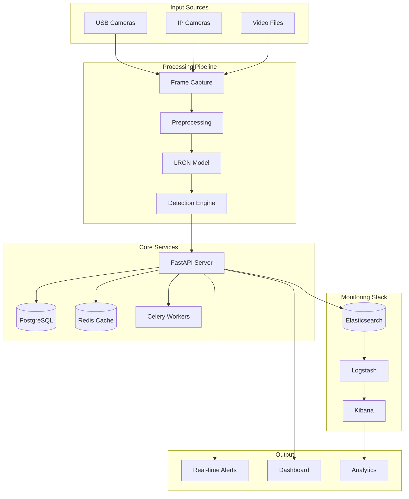

# Better Vigilant Surveillance


Advanced real-time surveillance system using Long-term Recurrent Convolutional Networks (LRCN) for behavioral analysis in retail environments.

## Quick Start

```bash
# Clone the repository
git clone <your-repository-url>
cd better-vigilant-surveillance

# Run automated setup
chmod +x scripts/setup_dev.sh && ./scripts/setup_dev.sh  # Linux/macOS
# OR
scripts\setup_dev.bat  # Windows

# Start infrastructure services
docker-compose -f docker-compose.dev.yml up -d

# Start the main application (includes API server)
python main.py

# In separate terminals (optional but recommended):
npm start                                    # Frontend
celery -A src.tasks worker --loglevel=info   # Background processing
```

**That's it!** The system will be running at http://localhost:8001

**[Complete Setup Guide](docs/00_GETTING_STARTED.md)** | **[Full Documentation](docs/README.md)**

## Key Features

### AI-Powered Detection
- **LRCN Neural Network** - Analyzes temporal behavioral patterns
- **Real-time Processing** - Processes video streams at 30 FPS
- **Adaptive Thresholds** - Configurable sensitivity levels
- **Background Subtraction** - Advanced preprocessing pipeline

### Multi-Camera Support
- **USB & IP Cameras** - Supports RTSP, HTTP streams
- **Video File Processing** - Batch analysis of recorded footage
- **Live Streaming** - HLS and MJPEG protocols
- **Concurrent Processing** - Multiple camera feeds simultaneously

### Intelligent Alerting
- **Real-time Notifications** - Instant alerts via WebSocket
- **Multi-channel Alerts** - Email, webhooks, Slack integration
- **Alert Management** - Acknowledge, dismiss, escalate alerts
- **False Positive Reduction** - Smart filtering and cooldown periods

### Enterprise Ready
- **Role-based Access** - Admin, Operator, Viewer permissions
- **Comprehensive Monitoring** - ELK stack integration
- **High Availability** - Docker-based deployment
- **Secure by Design** - JWT authentication, data encryption

## Architecture



## Technology Stack

| Component | Technology | Purpose |
|-----------|------------|---------|
| **AI/ML** | TensorFlow, OpenCV | LRCN model, computer vision |
| **Backend** | FastAPI, Python 3.8+ | RESTful API, WebSocket |
| **Database** | PostgreSQL, SQLAlchemy | Data persistence, ORM |
| **Cache** | Redis | Session storage, message broker |
| **Queue** | Celery | Background task processing |
| **Search** | Elasticsearch | Log aggregation, search |
| **Monitoring** | Logstash, Kibana | Log processing, visualization |
| **Deployment** | Docker, Docker Compose | Containerization |
| **Security** | JWT, bcrypt, cryptography | Authentication, encryption |

## System Requirements

### Minimum Requirements
- **CPU:** 4 cores (Intel i5 or AMD Ryzen 5)
- **RAM:** 8GB (16GB recommended)
- **Storage:** 50GB free space
- **OS:** Windows 10+, macOS 10.15+, Ubuntu 20.04+
- **Python:** 3.8 or higher

### Recommended (Production)
- **CPU:** 8+ cores with GPU support
- **RAM:** 32GB or more
- **Storage:** 500GB+ SSD
- **GPU:** NVIDIA GTX 1060 or better (for faster inference)
- **Network:** Gigabit Ethernet for IP cameras

## Documentation

| Documentation | Description |
|---------------|-------------|
| **[Getting Started](docs/00_GETTING_STARTED.md)** | Quick setup and first steps |
| **[Installation Guide](docs/10_INSTALLATION_GUIDE.md)** | Detailed installation instructions |
| **[Configuration Guide](docs/11_CONFIGURATION_GUIDE.md)** | Complete configuration reference |
| **[Troubleshooting](docs/12_TROUBLESHOOTING_GUIDE.md)** | Common issues and solutions |
| **[Complete Documentation](docs/README.md)** | Full documentation index |

### Feature Documentation
- **[System Overview](docs/01_SYSTEM_OVERVIEW.md)** - Architecture and components
- **[Frontend Architecture](docs/15_FRONTEND_ARCHITECTURE_GUIDE.md)** - React/TypeScript frontend guide
- **[API Reference](docs/16_API_REFERENCE.md)** - Complete API documentation
- **[Development Workflow](docs/17_DEVELOPMENT_WORKFLOW_GUIDE.md)** - Complete development process
- **[Deployment Guide](docs/18_DEPLOYMENT_GUIDE.md)** - Production deployment and infrastructure
- **[Frame Processing](docs/02_FRAME_PROCESSING.md)** - Video pipeline details
- **[LRCN Model](docs/03_LRCN_MODEL.md)** - AI model implementation
- **[Camera Management](docs/04_CAMERA_MANAGEMENT.md)** - Camera setup and configuration
- **[Alert System](docs/05_ALERT_SYSTEM.md)** - Alert configuration and management

## Security & Compliance

This system is designed for **legitimate security monitoring only**. Ensure compliance with:

- **Privacy Laws** - GDPR, CCPA, local regulations
- **Workplace Monitoring** - Employee notification requirements
- **Data Protection** - Encryption at rest and in transit
- **Access Control** - Role-based permissions and audit trails

**Important:** Change all default passwords and secrets before production deployment.

## Contributing

We welcome contributions! Please see our [Contributing Guidelines](CONTRIBUTING.md) for details.

### Development Setup
```bash
# Clone and setup development environment
git clone <your-repository-url>
cd better-vigilant-surveillance
chmod +x scripts/setup_dev.sh && ./scripts/setup_dev.sh

# Run tests
pytest tests/

# Code formatting
black src/
flake8 src/
```

## License

This project is licensed under the MIT License - see the [LICENSE](LICENSE) file for details.

## Support

- **Documentation:** [docs/README.md](docs/README.md)

## Version Information

- **Current Version:** 1.0.0
- **Python:** 3.8+
- **TensorFlow:** 2.16+
- **FastAPI:** 0.68+

---

**Built with care for retail security and loss prevention**
